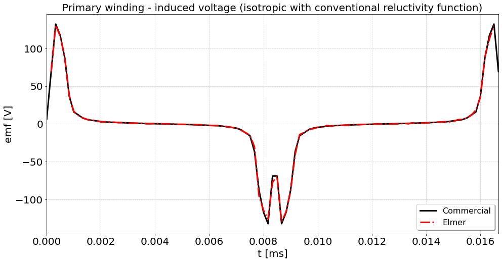
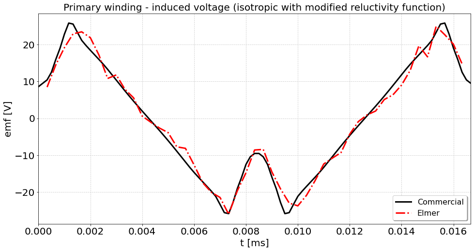
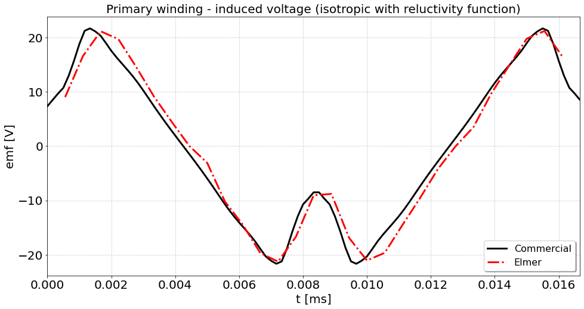
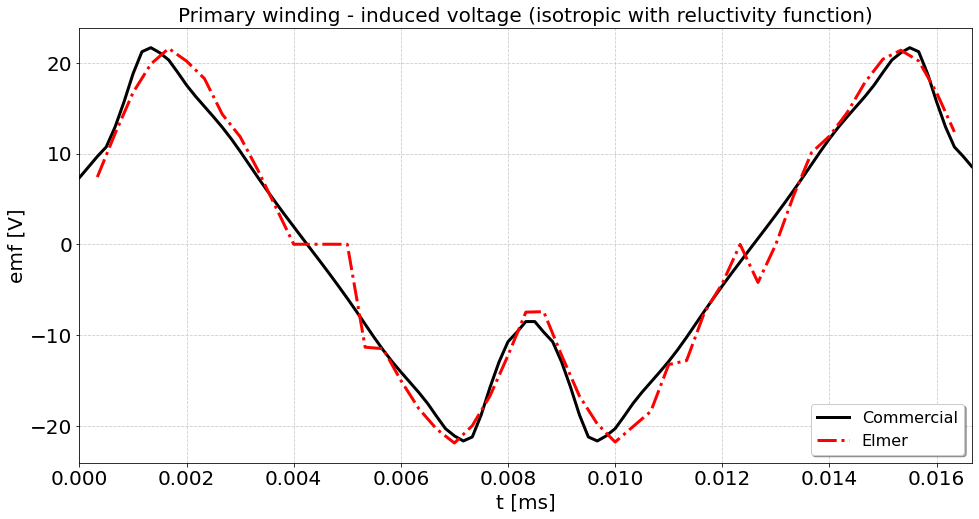
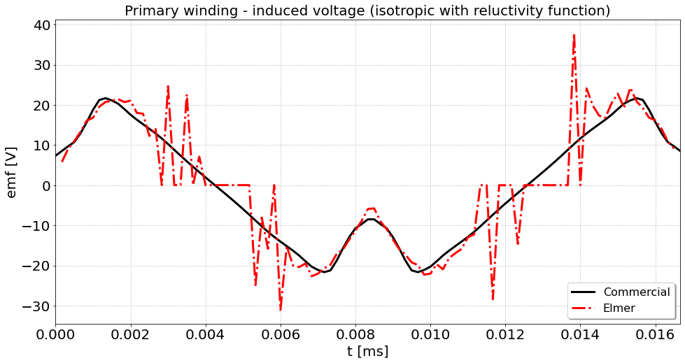

# Comparison between Elmer and commercial sotware

This is the anisotropic test. The geometry is arbitrary and did not follow any project or reference.
Simulation is carried out with a sinusoidal primary current input and a open secondary (high resistance value).
The model for core losses is a very simple one, just to get a uniform evaluation accross the different software platforms.
The core magnetizing curves are obtained from measurement and extrapolated.

For this simulation, Is = 0.02 A. Isotropic simulation is also defined with a reluctivity function, which uses same BH curve for all directions.

The files are as described bellow:
 - Output_M/Iso_nLin_WindingPlot - Results from commercial software for current and induced voltage for isotropic case. Is = 0.1 A.
 - Output_M/Iso_nLin_WindingPlot_0p02 - Results from commercial software for current and induced voltage for isotropic case.  Is = 0.02 A.
 - Output_M/Aniso_nLin_WindingPlot_0p02 - Results from commercial software for current and induced voltage for anisotropic case. 
 - Output_M/Aniso_nLin_LossPlot_0p02 - Results from core losses.  
 - res_3d_T3_nLin/res_3d_t_iso.dat - Output values from Elmer with isotropic non linear BH curve. Uses conventional reluctivity function from the tests.
 - res_3d_T4_nLin/res_3d_t_iso.dat - Output values from Elmer with isotropic non linear BH curve. Uses modified reluctivity function.
 - res_3d_T5_nLin/res_3d_t_ld_30.dat - Output values from Elmer with a timestep of 1/30 of the period.
 - res_3d_T5_nLin/res_3d_t_ld_50.dat - Output values from Elmer with a timestep of 1/50 of the period.
 - res_3d_T5_nLin/res_3d_t_ld_100.dat - Output values from Elmer with a timestep of 1/100 of the period.
 - res_3d_T5_nLin/res_3d_t_ld.dat.names - Identification of output varibles.
 - BH_DL_2_data.dat - Longitudinal direction BH curve.
 - BH_DT_2_data.dat - Transversal direction BH curve.
 - case_3d_ld_t_3_nlfi.sif - Elmer FEM simulation file. Isotropic non linear BH curve using conventional reluctivity function.
 - case_3d_ld_t_4_nlfi.sif - Elmer FEM simulation file. Isotropic non linear BH curve reluctivity function with decomposed BH curve for each direction.
 - case_3d_ld_t_5_nlfa.sif - Elmer FEM simulation file. Anisotropic non linear BH curve reluctivity function.
 - plot_curves.ipynb - Jupyter notebook for processing the results.
 - reluctivity_aniso - reluctivity function for isotropic non linear BH curve evaluation.
 - reluctivity_anisot - reluctivity function for anisotropic non linear BH curve evaluation.
 - transient_3d_lpri_extR_T.definition - Elmer circuit definition.

Results are as illustrated:

Comparison with isotropic non linear BH curve using conventional reluctivity function derived from a test case:
https://github.com/ElmerCSC/elmerfem/tree/devel/fem/tests/mgdyn_bh_relfun

Comparison with isotropic non linear BH curve using modified reluctivity function:

Comparison with anisotropic non linear BH curve using modified reluctivity function. Time step = 1/30 of simulation period:

Comparison with anisotropic non linear BH curve using modified reluctivity function. Time step = 1/50 of simulation period:

Comparison with anisotropic non linear BH curve using modified reluctivity function. Time step = 1/100 of simulation period:

