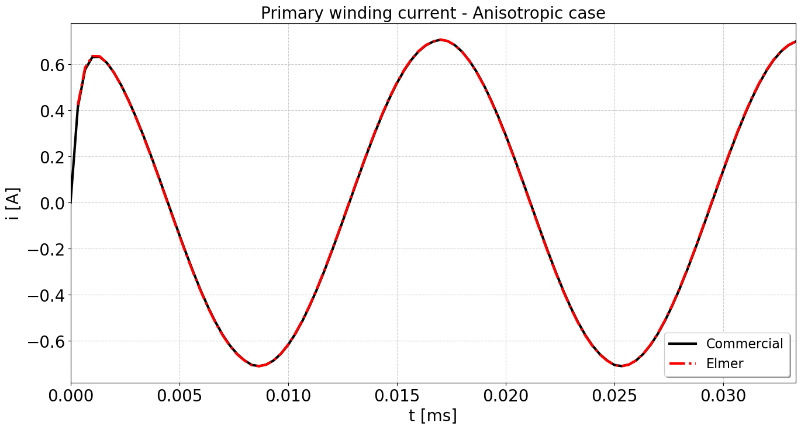

# Comparison between Elmer and commercial sotware

This is the anisotropic test. The geometry is arbitrary and did not follow any project or reference.
Simulation is carried out in two operating conditions:
 - Folder Elmer_3d_Vs: with a sinusoidal primary voltage and a open secondary (high resistance value).
 - Folder Elmer_3d_VsLd: with a sinusoidal primary voltage and resistive load at the secondary.

The model for core losses is a very simple one, just to get a uniform evaluation accross the different software platforms.
The core magnetizing curves are obtained from measurement and extrapolated.

The magnetization curves are obtained from measurement and it was used a procedure to interpolate (smooth) and extrapolate. 
These as illustrated as follows:

Each case is simulated using a isotropic core (case_3d_ld_t_5_nli.sif) and a anisotropic core (case_3d_ld_t_5_nlfa.sif).
Results are pretty close, and these are more thoroughly compared in the jupyter notebooks (plot_curves_VsLd.ipynb and plot_curves_Vs.ipynb) in each folder.

One issue is that simulation times are very long for anisotropic cases:

Input voltage and open secondary

Elmer FEM:

•	Isotropic – 41:40

•	Anisotropic – 294:00

Commercial software:

•	Isotropic  – 43:35

•	Anisotropic – 63:15

Input voltage and resistive secondary load

Elmer FEM:

•	Isotropic – 46:38

•	Anisotropic – 155:24

Commercial software:

•	Isotropic  – 31:01

•	Anisotropic – 43:40

Results are as illustrated:

Current with input voltage and open secondary:

Current with input voltage and secondary resistive load:

