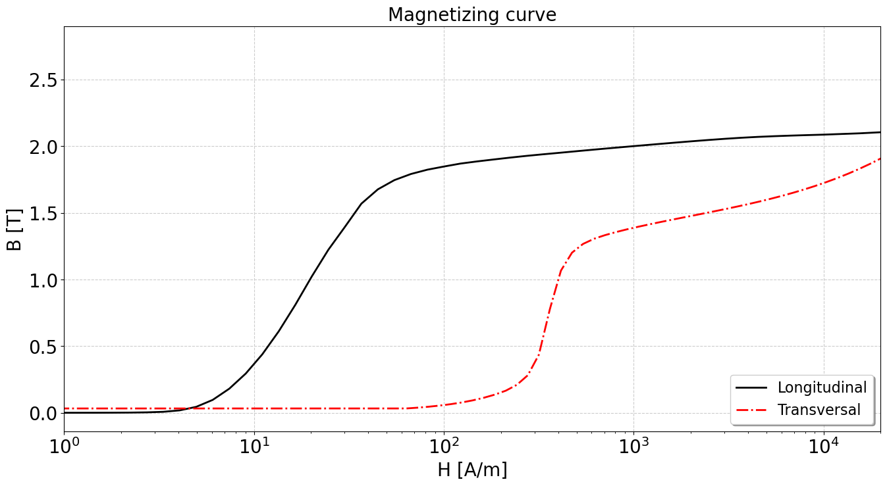
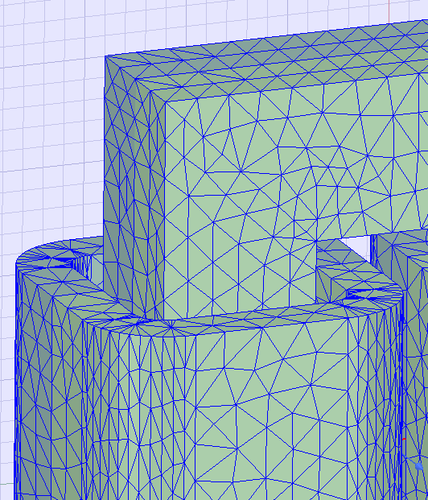

# Comparison between Elmer and commercial sotware

This is another anisotropic test. The geometry is arbitrary and did not follow any project or reference.
Simulation for different material properties for steady state condition only, considering isotropic and anisotropic for both linear and non-linear bh curves.
The magnetization curves are obtained from measurement and it was used a procedure to interpolate (smooth) and extrapolate. 
These curves, that is DL (longitudinal lamination direction) and DT (transversal to lamination direction), are illustrated as follows:
  

  
The simulations are compared against a commercial software which uses second order elements and iterative solver (direct solver is default, but I've chosen iterative). 
  
The commercial software has an adaptive mesh refinement procedure. The figure below illustrates the final mesh.
  

  
The simulating times for commercial software (using the final mesh, so it is only the solver time):
- Isotropic linear - 30s
- Anisotropic linear - 47s
- Isotropic non-linear - 60s
- Anisotropic non-linear - 380s
  
Running Elmer on Mint 21.2 with mpirun -np 4. Each folder has a jupyter notebook for comparing the results (res_AM are the commercial software results)
  
Folder EF_Iso_Lin  
  res_lin_v1 -> SOLVER TOTAL TIME(CPU,REAL):         6.08        5.31  
  res_lin_v1_M -> SOLVER TOTAL TIME(CPU,REAL):        11.13       11.96  
  res_qd_v1 -> SOLVER TOTAL TIME(CPU,REAL):        47.16       42.75  
  
Folder EF_Iso_Nlin
  res_lin_iter_v1 -> SOLVER TOTAL TIME(CPU,REAL):        21.77       17.52  
  res_qd_v1 -> Didn't converge  
  res_qd_v2 -> SOLVER TOTAL TIME(CPU,REAL):       296.37      258.28  
  res_qd_v3 -> SOLVER TOTAL TIME(CPU,REAL):       164.81      149.66  
  res_lin_dir_v1 -> SOLVER TOTAL TIME(CPU,REAL):       174.12      184.83 (nlin conv tol = 1e-4) 
  res_lin_dir_v1 -> Didn't converge  
  
Folder EF_Aniso_Lin  
  res_iter_1mu0 -> SOLVER TOTAL TIME(CPU,REAL):      1974.53     1677.86  
  res_iter_10mu0 -> SOLVER TOTAL TIME(CPU,REAL):       313.31      272.75  
  res_iter_100mu0 -> SOLVER TOTAL TIME(CPU,REAL):       138.16      134.73  
  res_iter_100mu0_2 -> SOLVER TOTAL TIME(CPU,REAL):        74.39       74.92 ! Didn't converge in other conditions  
  res_iter_1000mu0 -> SOLVER TOTAL TIME(CPU,REAL):        68.91       68.44  
  res_lin_dir_v1 -> SOLVER TOTAL TIME(CPU,REAL):        10.75       11.81  
  
Folder EF_Aniso_Nlin  
  res_lin_iter_v1 -> SOLVER TOTAL TIME(CPU,REAL):       463.21      348.69  
  res_qd_iter_v1 -> SOLVER TOTAL TIME(CPU,REAL):      1748.44     1504.15  

  Issues:
  Can not run vanka with mpi
  Solver times changes significantly with anisotropic permeability (please refer to linear case)

