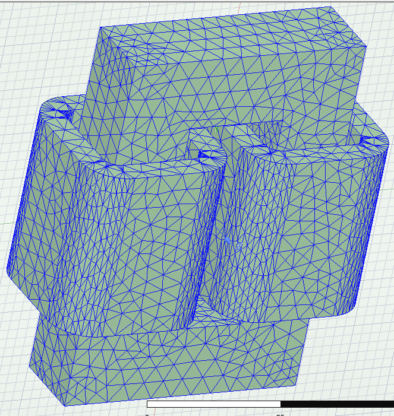
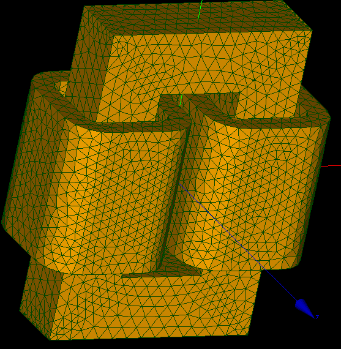
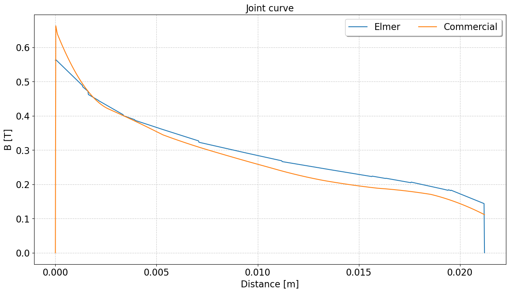
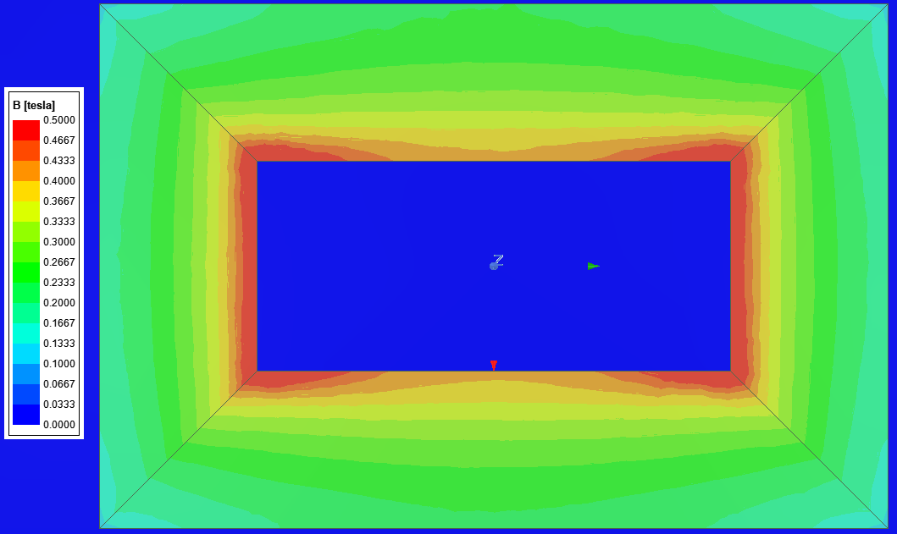
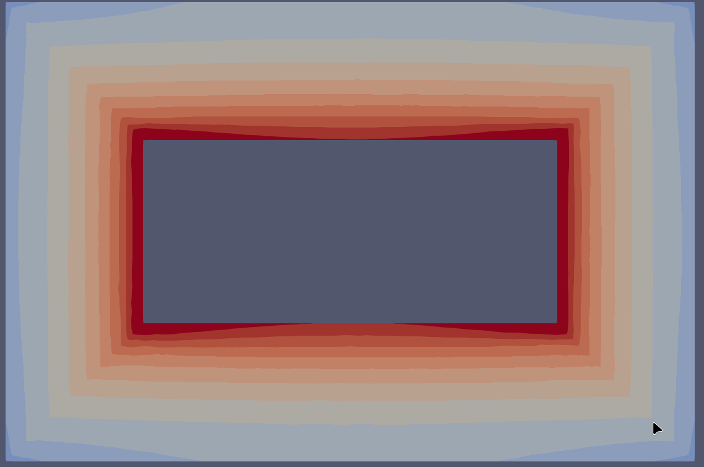

# Comparison between Elmer and commercial sotware

From the last test, I did a few adjustments to the sif file based on the tips given by Peter.  
Also, the reluctivity funcitions were modified, z-axis relalive permeability is not 1, but 100 and saturates at 1.5 T. 

  IF(BabsZ > 1.5) THEN
    nuZ = 1 / mu0
  ELSE
    nuZ = 1 / (100*mu0)
  END IF

This value does not create a flux in the z-axis (it is evaluated here), but the simulation time is significantly changed, as shown below:
DZ = 1 - 982.23s (5 NL iter )
DZ = 50 - 576.90s (5 NL iter)  
DZ = 100 - 385.55s (5 NL iter)
DZ = 1000 - 215.00s (5 NL iter)

This is another anisotropic test. The geometry is arbitrary and did not follow any project or reference.
Simulation for different material properties for steady state condition only, considering isotropic and anisotropic for both linear and non-linear bh curves.
The magnetization curves are obtained from measurement and it was used a procedure to interpolate (smooth) and extrapolate. 
  
The simulations are compared against a commercial software which uses second order elements and iterative solver (direct solver is default, but I've chosen iterative). Convergence tolerance is the same as used in Elmer.  
  
The commercial software has an adaptive mesh refinement procedure. The figure below illustrates the final mesh.
The mesh for the tests tried to replicate the optimized mesh from the commercial software.  

  

  
  
The simulating times for commercial software (using the final mesh, so it is only the solver time):  
- Anisotropic non-linear - 380s
  
Running Elmer on Mint 21.2 with mpirun -np 4. Each folder has a jupyter notebook for comparing the results (res_AM are the commercial software results). Following are the case files and result folders for different tests.  
  
Folder EF_Aniso_Nlin  
  case_3d_qd_AnisoNlin_pr.sif / res_qd_iter_v1 -> SOLVER TOTAL TIME(CPU,REAL):       588.76      502.89

Results comparison:

  
  
  

  Issues:  
    Can not run vanka with mpi  
    Solver times changes significantly with anisotropic permeability (please refer to linear case)  

