Test case for linear systems.  
  
This folder has different test cases for a simplest case of magnetic flux distribution in a simplified transformer core.  
  
The core is defined only at one joint, leg and yoke. Magnetic flux is driven by a boundary condition. There is a dummy surface, or volume, but it is there only for numerical purpose. The relative permeability is low enough to avoid magnetic flux.  

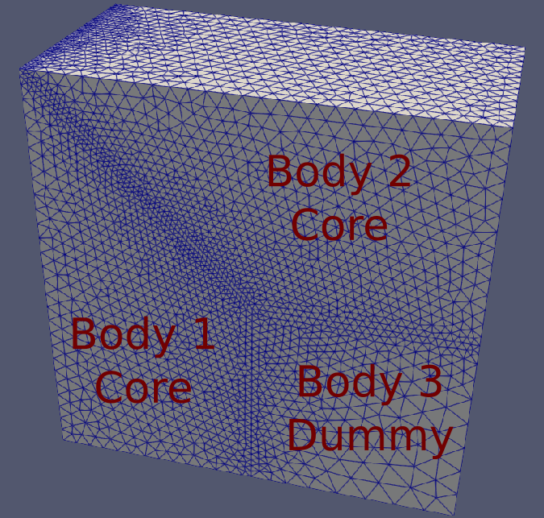  
  
The meshes are created using gmsh python and there are some refinement parameters:   
  
# === Input Parameters ===  
# -> Mesh Control <-  
  
mesh_all = 15            # Overall mesh size  
mesh_core = 15/2         # Overall mesh core size  
mesh_inner_surf = 15/4   # Mesh size for inner surface (adjacent to 'none' region)  
mesh_joint = 15/4        # Mesh size for joint surface (between leg and yoke)  
  
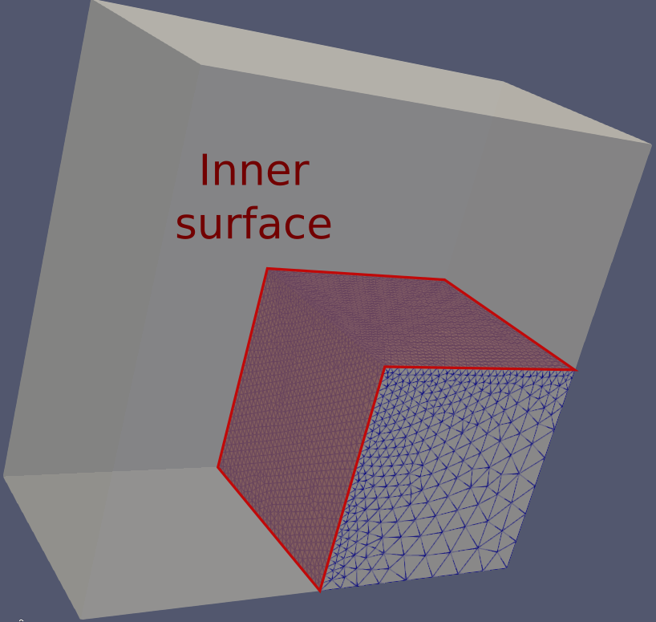  
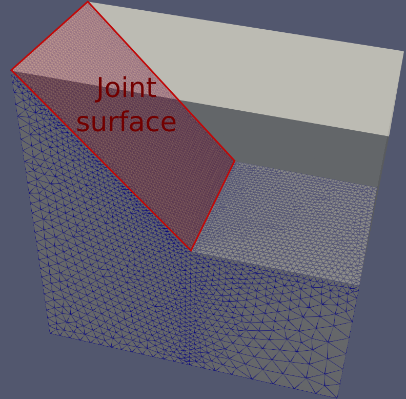  
  
The cases were compared with FEMM simulation.
  
2D base:  
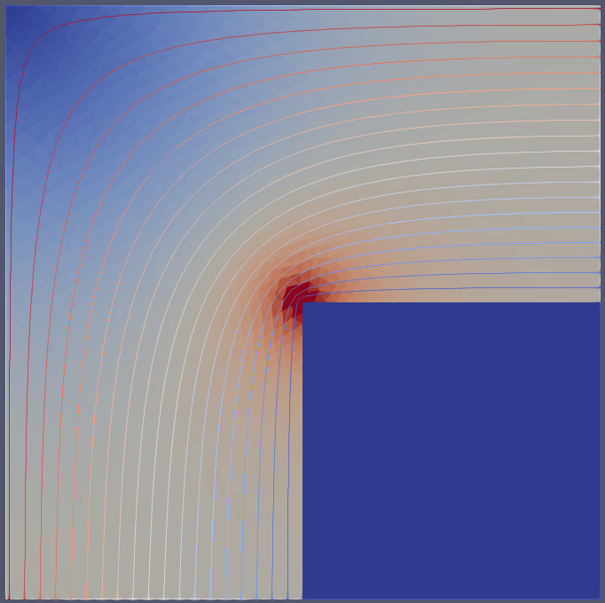   
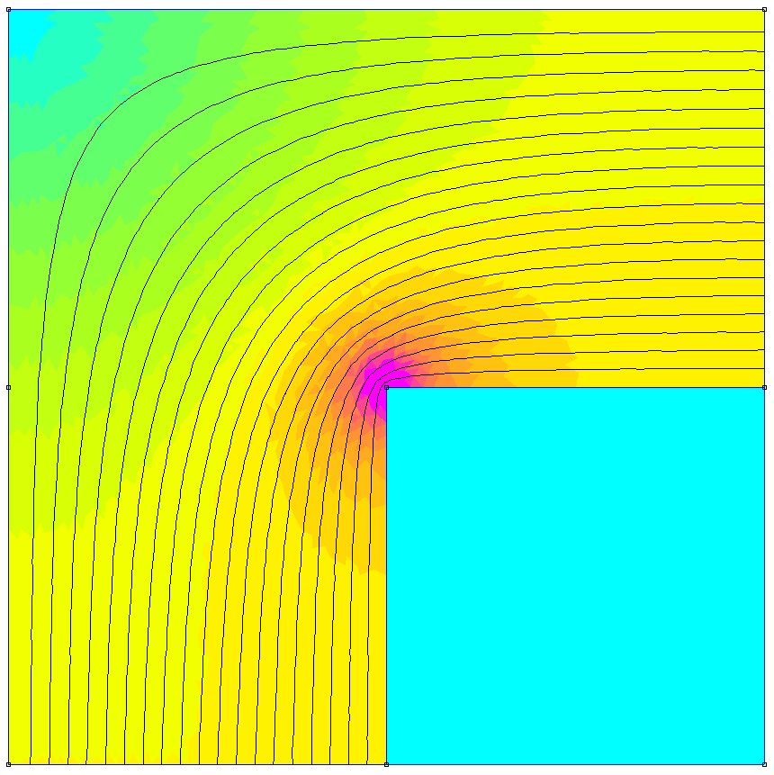   
  
2D base anisotropic linear:  
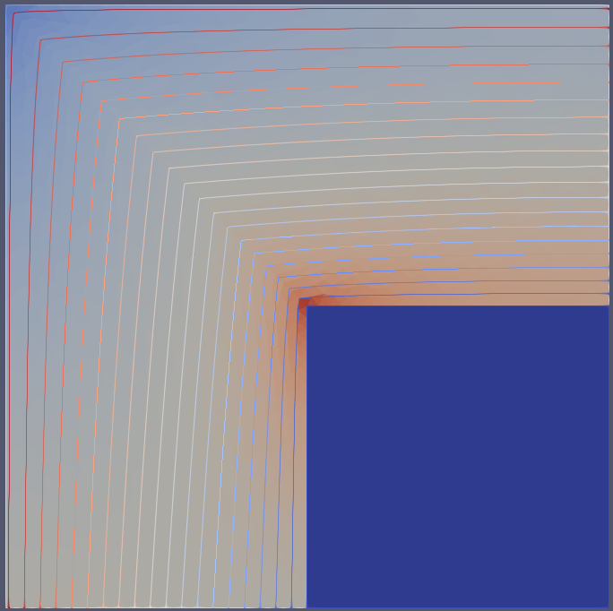   
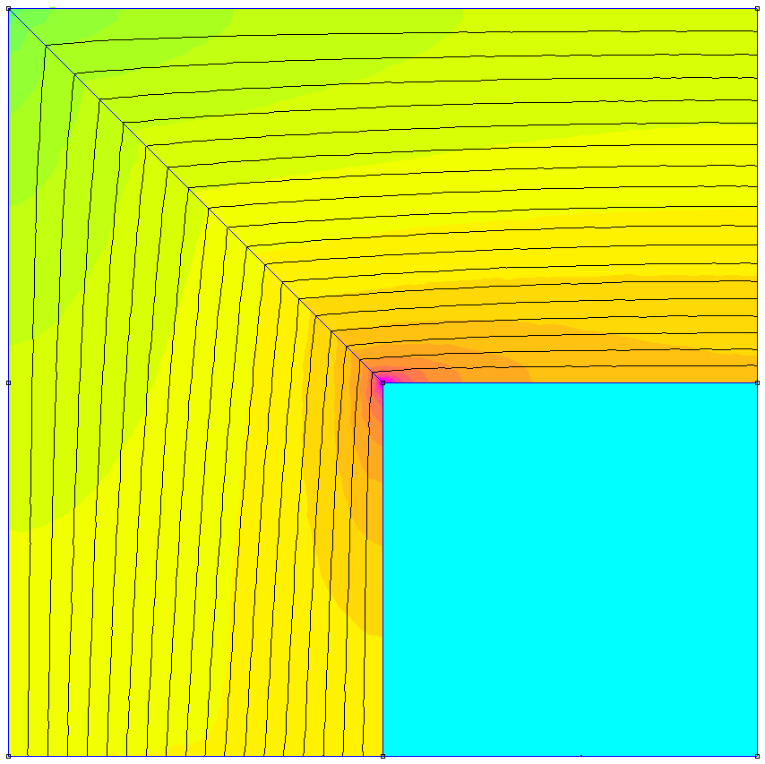   
  
3D base:  
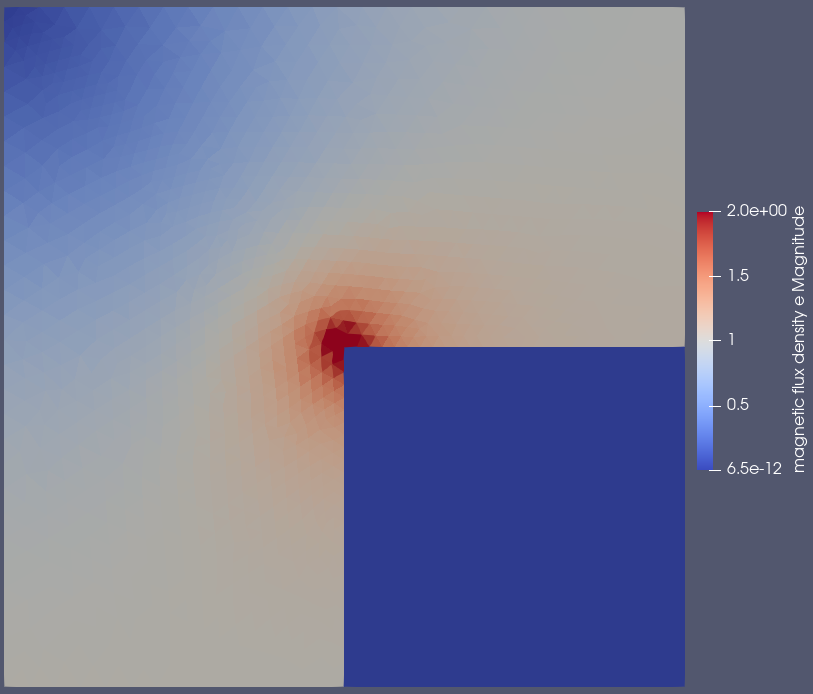   
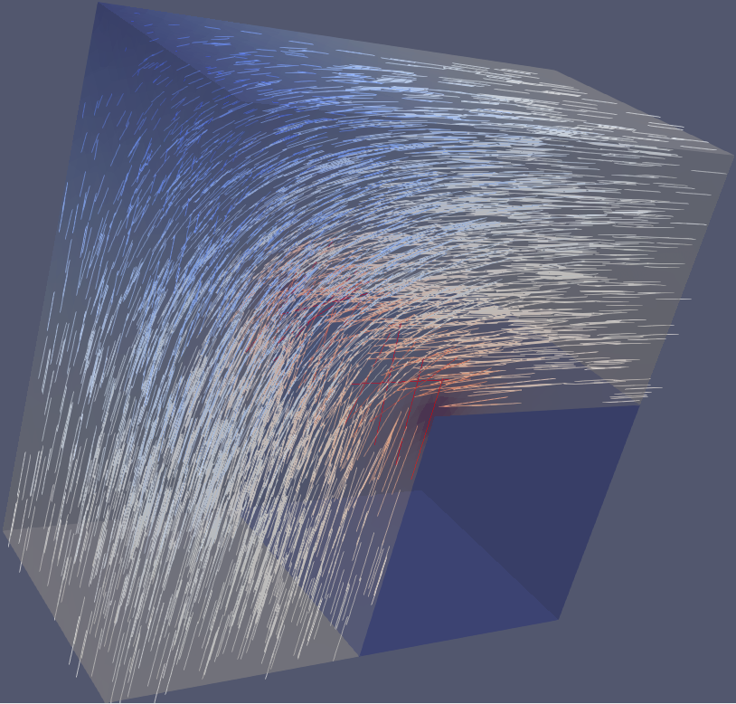  
   
3D base anisotropic:  
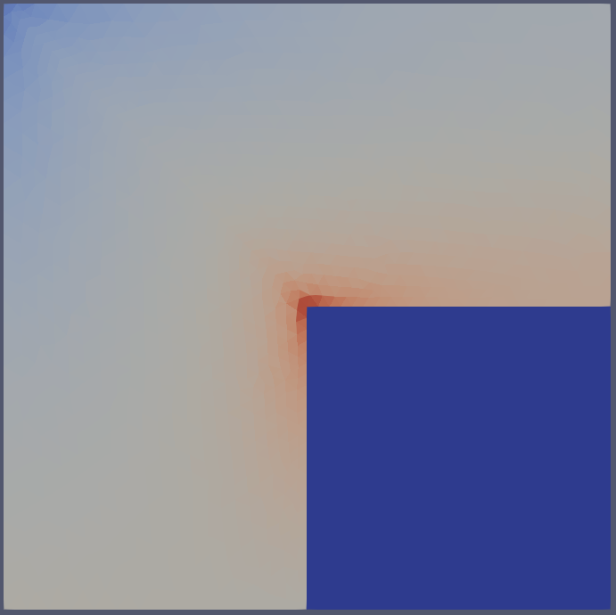   
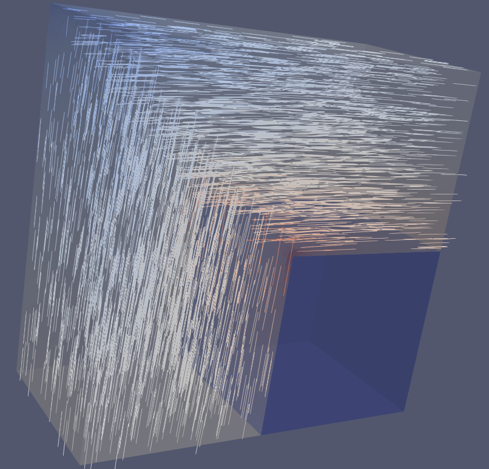   

  
  

