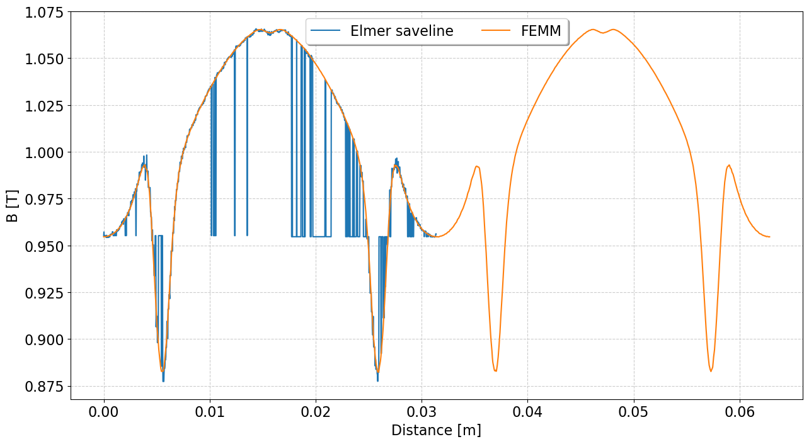
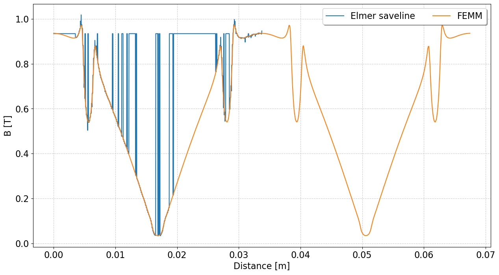
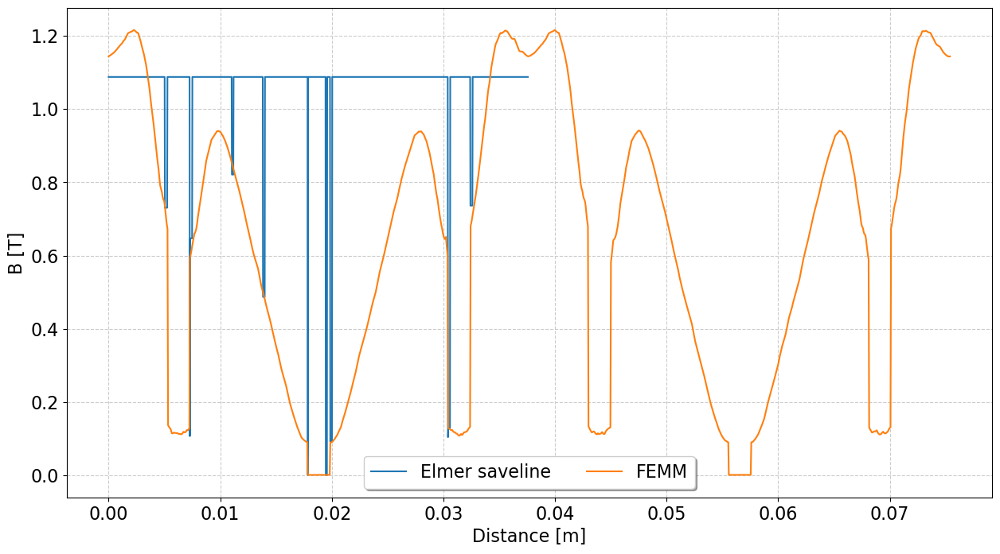
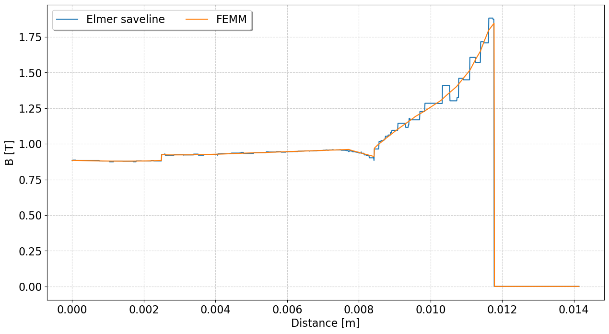
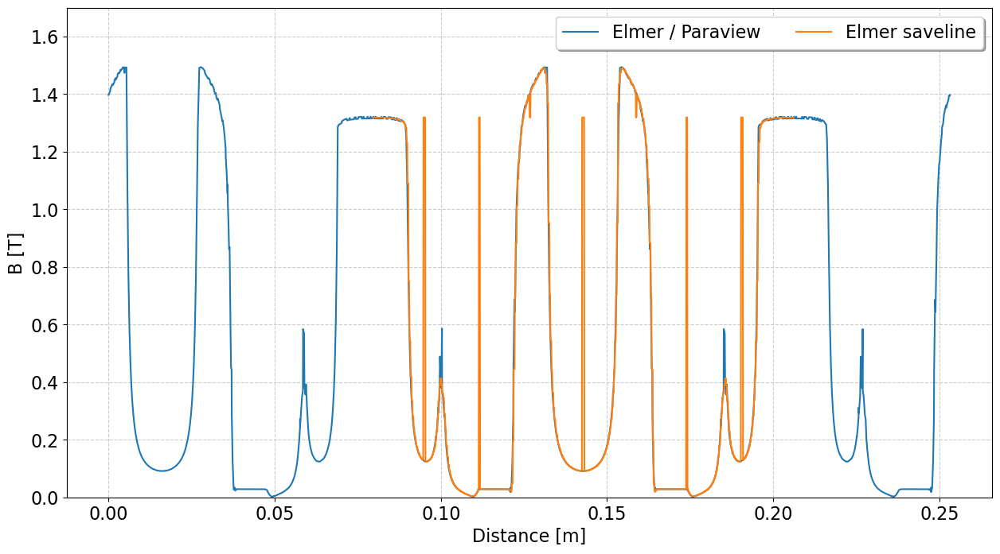

Test case save line over circunferential arc
  
Trying to get saveline to work for the FEMM to Elmer procedure

The case 1 is obtained from a simulation ran in FEMM and converted to Elmer. Please refer to:

[Elmer forum link](https://www.elmerfem.org/forum/viewtopic.php?t=8094)

Case 1 plot (run case_1/plot_curves.ipynb to replicate)

r = 10 mm:
  

r = 10.738 mm (air-gap):
  

r = 12 mm:
  

line from (5,-5) to (15,5):
  

The case 2 is from Pavel tutorial for PMSM.

[Pavel tutorial link](https://www.researchgate.net/publication/275890336_FEM_Modeling_of_PMSMs_Using_Elmer)

Case 2 plot (run case_2/plot_curves.ipynb to replicate)
  
 

  
  

