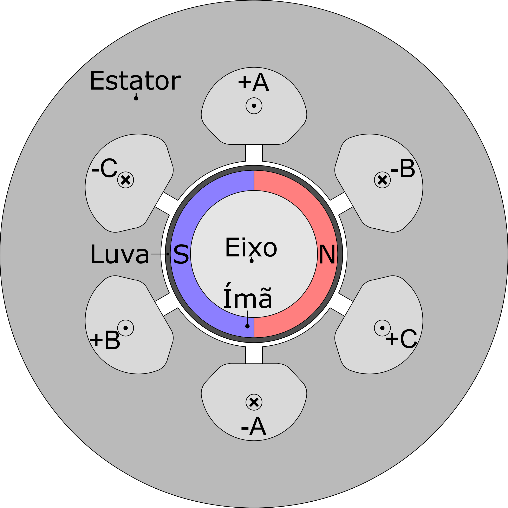
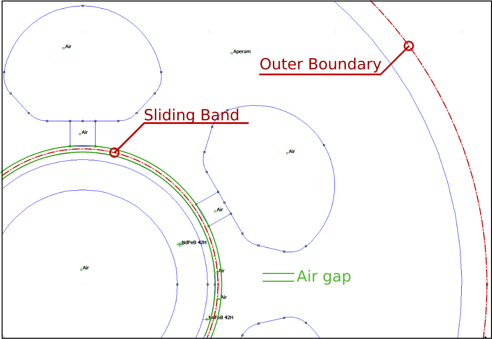
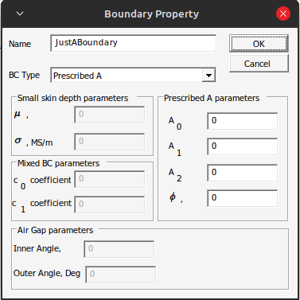
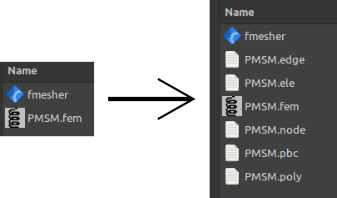
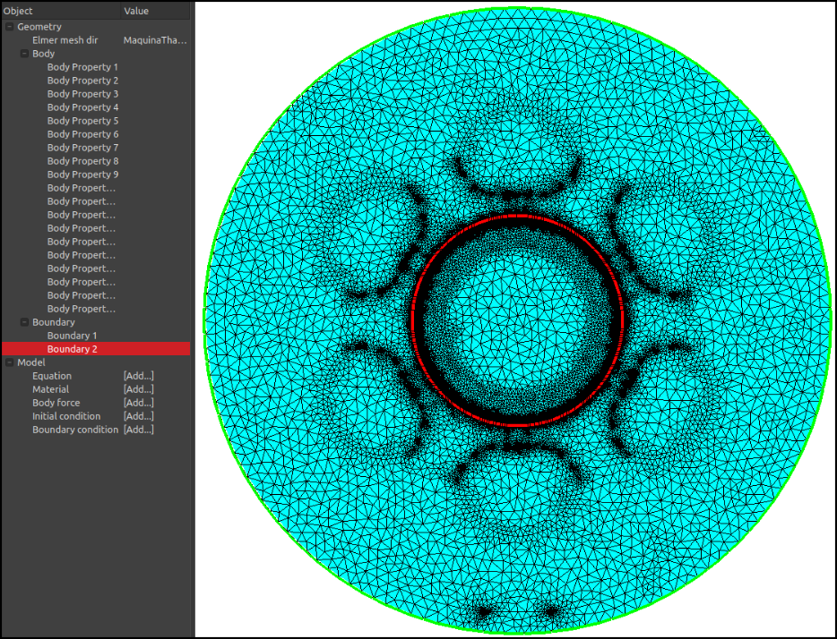
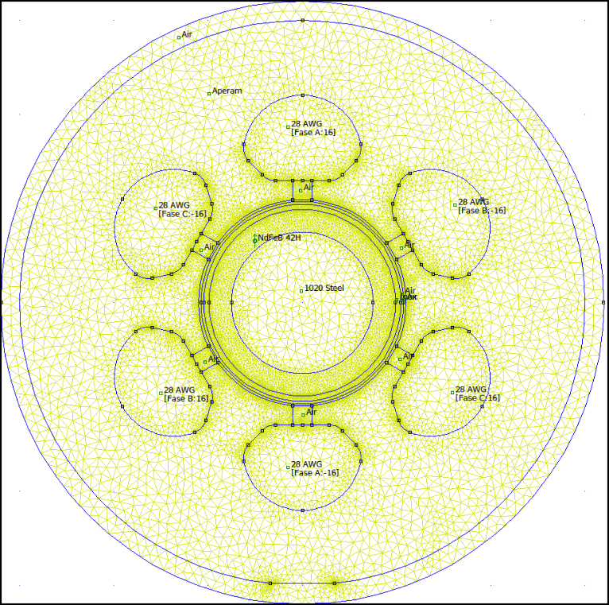
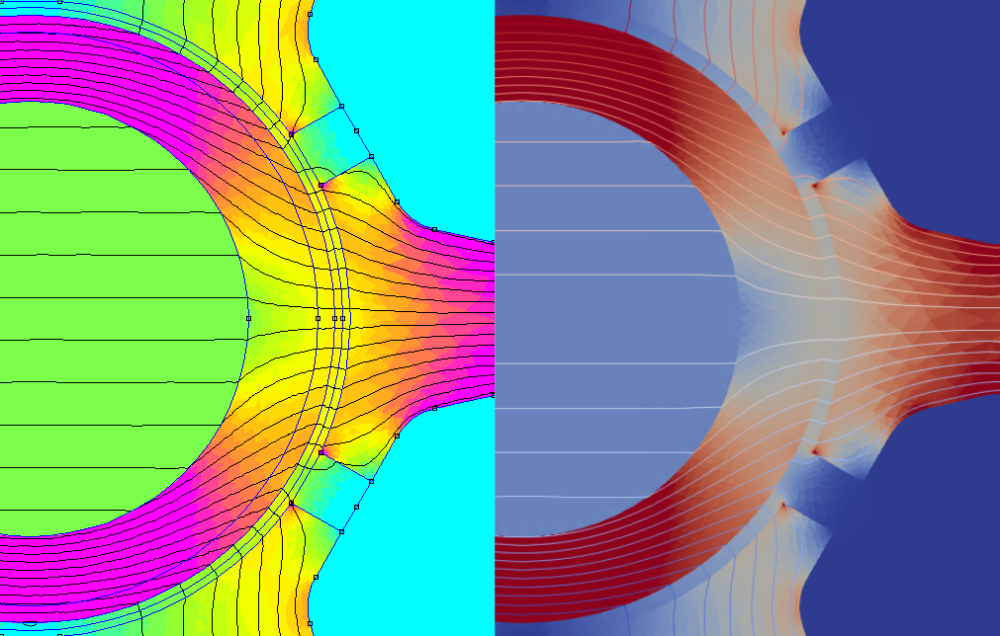
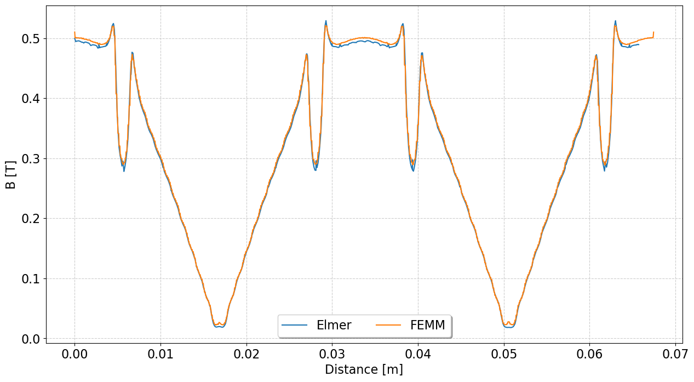
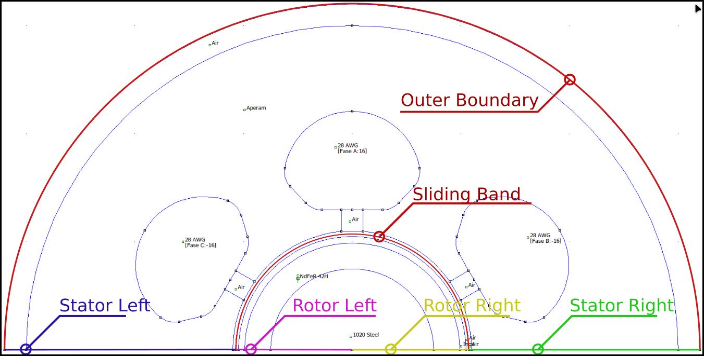
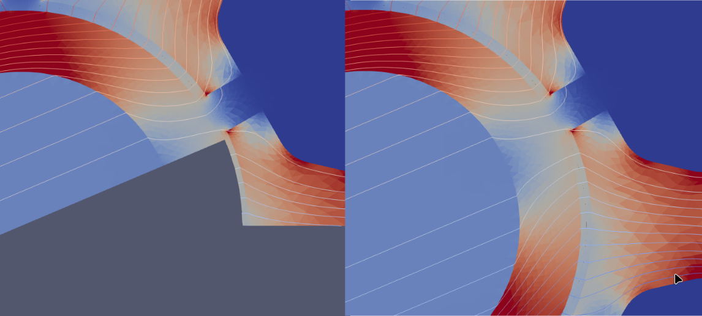

# How to import and use a mesh generated for FEMM.  

## Full geometry case
  
First, the electrical machine under evaluation is a high-speed surface-mounted synchronous PM machine. It has six slots and two poles. The magnet is protected with a stainless steel retaining sleeve.
  
<!--  -->
  
  
For simulation in FEMM, only one Boundary condition is defined, that is the outer boundary (with ). Here I don’t need to rotated the model. So, in order to use this mesh in Elmer, a second boundary needs to be created for the sliding band (mortar BC).  
  
  
This boundary is created only for the mesh conversion process, so it can be defined as a ‘Prescribed A’ BC type.  
  
  
Now, for the conversion, we need to get the mesh files from FEMM, but these can not so easily be found. There are two options:  
- With xfemm. Download the files from xfemm appropriate to operating system (https://sourceforge.net/projects/xfemm/files/v4.0/). This project provides a program that generates the mesh files from the *.fem file, fmesher for linux or fmesher.exe for win. The binary for this is located in ‘cfemm/bin’. With this binary, run the command: ***‘./fmesher --write-poly your-file.fem’***.  
- Workaround: Before running an Analysis browse to the folder where FEMM is installed and in the "bin" folder rename the file "fkn.exe" (the solver) to something else, such as "afkn.exe". Now run the Analysis in FEMM. You should get an error message "Problem executing the solver". However, in the folder where your model "fem" file is located there will now be several new files. The ".pbc" file is the Periodic Boundary Conditions file which identifies which nodes on the boundaries are defined by a common periodic boundary condition. The location of the nodes can be found in the ".node" file according to the node number. There is also a ".ele" file defining the elements, ".poly" defining the geometry of the model, and ".edge" related to the mesh [ref: https://groups.io/g/femm/message/2047?p=%2C%2C%2C20%2C0%2C0%2C0%3A%3Arecentpostdate%2Fsticky%2C%2C.poly%2C20%2C2%2C0%2C54947378].  
  
  
  
Now, just convert using ***‘ElmerGrid 11 2 your-file -autoclean’***, which results in the mesh as illustrated below.  
  
  
For comparison with FEMM:  
  

One thing about this procedure is that the bodies must be identified manually for the definition of Elmer problem without GUI. 

The boundary for mortar BC is created and ca be used to define the problem within Elmer. Only issue that was found is that the boundary definition need the keyword **‘Discontinuous Target Bodies = Integer’** so the problem can run:
```
Boundary Condition 2
  Target Boundaries(1) = 2
  Name = "Sliding"
  Discontinuous Boundary = Logical True

  ! Without this -> ERROR:: CreateDiscontMesh: Alternative strategy requires all parent elements!
  Discontinuous Target Bodies = 10

  Save Line = True
  Mortar BC = 3
  Rotational Projector = Logical True
	Galerkin Projector = Logical True
End
```

Without this, the simulation stops with the error ‘ERROR:: CreateDiscontMesh: Alternative strategy requires all parent elements!’.

The results are illustrated as follows. Here, the sleeve is also modeled as a magnet. Coils, rotor axle are modeled as ‘air’. Electrical steel is linear with a relative permeability of 10,000.

  


## Using symmetry to simplify the problem.

We can alse define a procedure with problems with simplified geometries (derived from symmetric flux distribution).  
For the case of the present example, the PMSM has 2 poles, so we only need to simulate half of it. Now, we need to define some additionl BC in FEMM:




All boundaries are defined just to help with conversion, so they must be set as 'Prescribed A'. Using FEMM regular BC defintion would bring some problems (I think).  

The results are very close to full model:  




